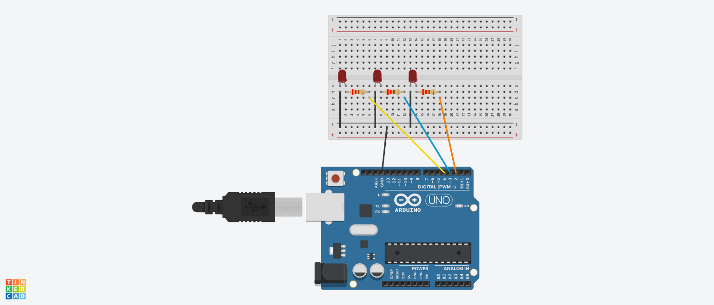

<h1>ARDUINO CONTROLADO POR UMA INTERFACE GRÁFICA</h1>

<h2>Resumo</h2>

Nesse projeto foi montado um arduino com três LEDs, que são controlados através de uma interface Gráfica montada em C#
<h2>Tecnologias usadas</h2>

* Arduino
* C#

<h2>Componentes usados</h2>

* 3 resistores de 220	Ω
* 3 LEDs
* Um arduino

<h2>Ligações</h2>

Para esse projeto, foi usada as portas digitais 2,3 e 4, mas você pode usar outras portas, lembrando de trocar os valores no código do arduino.